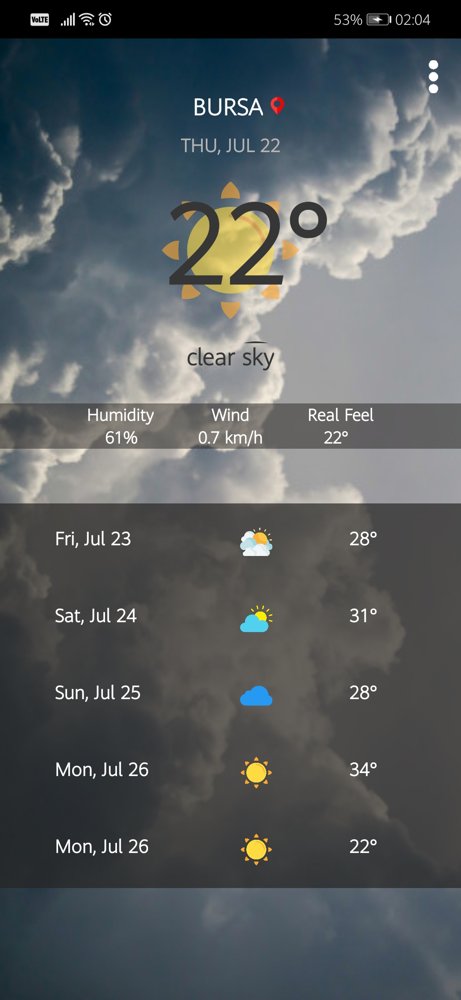
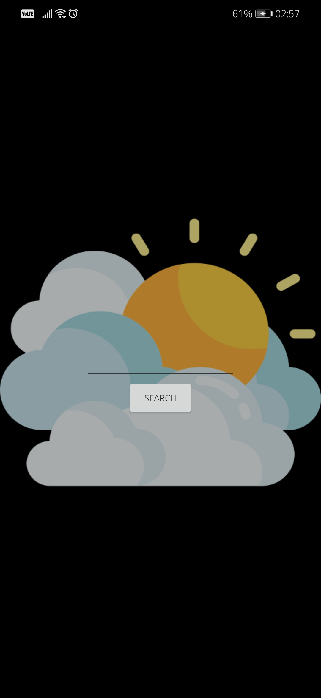
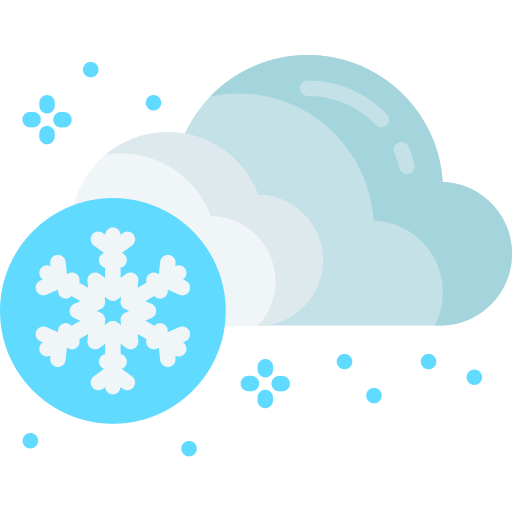

<p align="center">
  
</p>

<h1 align="center">WeatherApp</h1>

<p align="center">:sun_behind_small_cloud: An awesome Android weather forecast app, which uses OpenWeatherMap API. :open_umbrella::cloud_with_lightning_and_rain: ( Java, Android Studio ) </p>

<p align="center">
  <strong>
    <a href="#about">About</a> • 
    <a href="#features">Features</a> • 
    <a href="#built-with">Built with</a> • 
    <a href="#usage">Usage</a> • 
    <a href="#contributing">Contributing</a> • 
    <a href="#support--feedback">Support & Feedback</a> • 
    <a href="#license">License</a>  
  </strong>
</p>

<p align="center">
   &emsp;
   &emsp;
</p> 

<p align="center"> 
  
   
   
   
   
   
   
   
</p> 

## About

WeatherApp is a simple weather forecast app, which uses [OpenWeatherMap](https://openweathermap.org/) API to fetch 5 day / 3 hour forecast data based on given location. This application, developed in the Android Studio environment, processes the temperature, wind, pressure, weather and humidity data fetched in JSON format and displays them to the user.

### Features
Some of the features the project includes:

- Weather info by current location
- 5 Day Forecast
- Current humidity, wind and real feel info
- Search weather by location
- Secure API key

### Built with

- [Android Studio](https://developer.android.com/studio) - Android Studio is the official Integrated Development Environment (IDE) for Android app development, based on IntelliJ IDEA.
- [OpenWeatherMap](https://openweathermap.org/) - OpenWeatherMap is an online service that provides global weather data via API, including current weather data, forecasts, nowcasts and historical weather data for any geographical location.

## Usage

In order to use the project, you first need your own OpenWeatherMap API key:

1. Sign up on [OpenWeatherMap](https://openweathermap.org/) to get your api keys.
2. Once you've registered go to your Account > My API keys. The 'Default key' is what you'll need.
3. Set the `ApiKey` property in [`gradle.properties`](./gradle.properties) file to your api key.
```properties
ApiKey = YOUR_OPENWEATHERMAP_API_KEY
```

## Contributing
Want to contribute? Great!
To fix a bug or enhance an existing module, follow these steps:

1. Fork the Project
2. Create your Feature Branch (`git checkout -b feature/enhanced-feature`)
3. Commit your Changes (`git commit -m 'Add some enhanced-feature'`)
4. Push to the Branch (`git push origin feature/enhanced-feature`)
5. Open a Pull Request

## Support & Feedback
If you are having technical issues or want to raise a bug/issue with the app, the preferred way is through [GitHub issues](https://github.com/enessfk/WeatherApp/issues). In order to contact with me for any other request please send an email to: **eneskeskinfk@gmail.com**

## License

Distributed under the MIT License. See `LICENSE` for more information.

